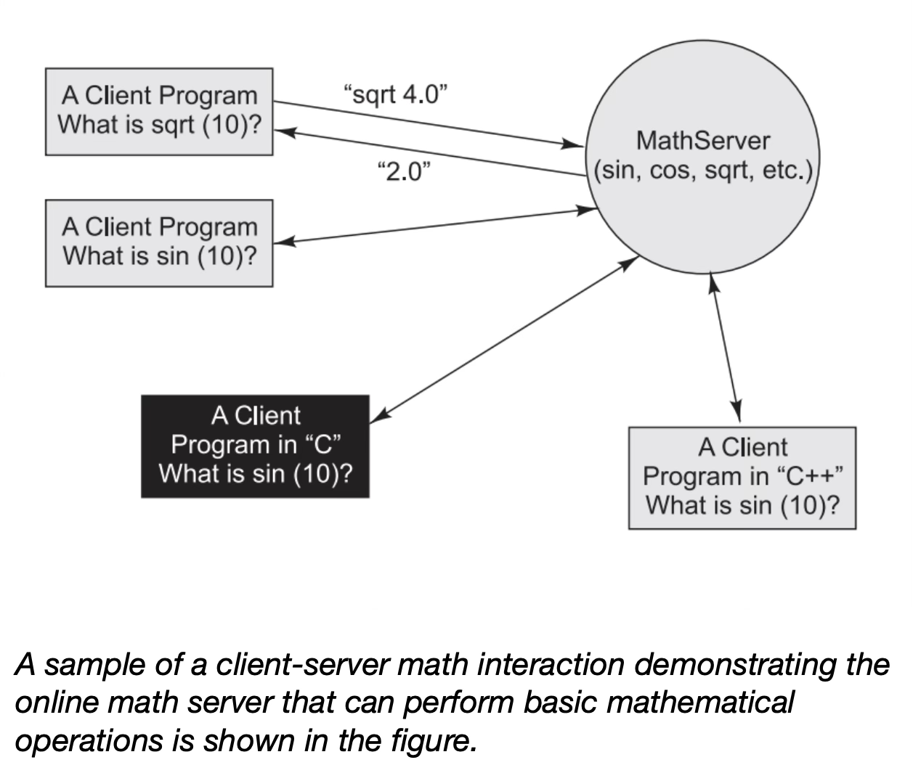
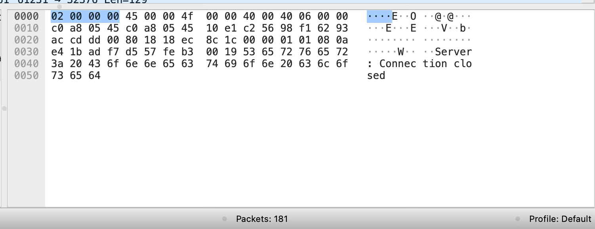
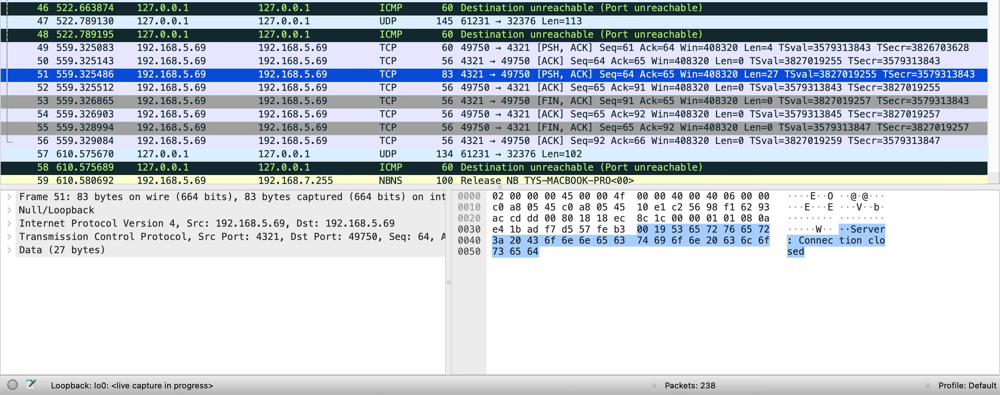

# Math Server

**Author:** Thaís Faustino Calixto  
**Course:** Computer Networks

---

## 📚 Project Overview

During my undergraduate studies, I developed the **Math Server Project** as part of the Computer Networks course.  
The main objective was to apply knowledge of socket programming by creating a **client-server application** capable of handling multiple mathematical operations.

The server was implemented in **Java** with **multithreading**, allowing it to handle multiple client requests simultaneously.

---

## 🎯 Purpose

The project implements a **client-server architecture** for performing mathematical operations.  
The **client** sends calculation requests, and the **server** processes these requests and returns the results.

Supported operations include:
- Addition
- Subtraction
- Multiplication
- Division
- Square root
- Sine
- Cosine

---

## 🗂️ Files Overview

| File | Description |
|:---|:---|
| `Calculator.java` | Implements the core mathematical operations using an `ArrayList<Double>` to store input numbers. Each method performs a specific operation. |
| `Server.java` | Acts as the main server application. Opens a `ServerSocket` on port 4321 to listen for clients. Spawns a new thread (`ServerThread`) for each client. |
| `ServerThread.java` | Handles individual client connections in separate threads. Reads operation type and input numbers, calls the `Calculator`, and sends back the result. |
| `Cliente.java` | Client application. Connects to the server, uses a GUI (`JOptionPane`) to select an operation and input numbers, sends the request, and displays the result. |

---

## 🏗️ Architecture

- **Client-Server Model:**
  - The **client** (`Cliente.java`) sends requests to the **server** (`Server.java`).
  - The **server** spawns a new thread (`ServerThread.java`) for each client connection.
  - The **Calculator** class handles the requested mathematical operation.

### 📸 Architecture Diagram



---

## 🚀 Strengths

- **Modular Design:** Each class has a clear responsibility, making the code easy to maintain and extend.
- **Concurrency:** The server can handle multiple clients simultaneously through multithreading.
- **Dynamic Operations:** Supports both unary and binary operations with minimal changes on the client side.

---

## 🛠️ Compilation Steps

1. Ensure you have **Java Development Kit (JDK)** installed.
2. Navigate to the project directory and compile all Java files:

   ```bash
   javac *.java
   ```

3. Start the server:

   ```bash
   java Server
   ```

4. Run the client:

   ```bash
   java Cliente
   ```

---

## ⚡ Notes

- The client displays a **GUI** to select operations and input numbers.
- The server processes the request and returns the result.
- Ensure the server is running before starting the client.
- Verify that port **4321** is not blocked or used by another application.
- To stop the server, press `Ctrl + C` in the terminal.

---

## 🛰️ Network Analysis with Wireshark

As part of the development, **Wireshark** was used to monitor and analyze TCP communication between client and server.

Wireshark allowed me to inspect the data packets exchanged during the socket connection and better understand how information is transmitted over the network.

By capturing the traffic, I could verify that the mathematical operations requested by the client were correctly received by the server, and that the responses were accurately sent back. This helped debug potential issues, such as incorrect formatting of requests or delays in responses, and ensured that the implementation followed the expected TCP/IP protocol behavior.

Using Wireshark was essential for validating the functionality of the application at the network level and gaining a deeper understanding of how socket communication happens behind the scenes.


### 📸 TCP Three-Way Handshake

Below we can observe the three-way handshake used to establish a TCP connection between the client and the server. The first line shows a SYN packet sent from the client to the server, indicating the start of the connection request. The source port (usually a random high number, in this case 49750) and the destination port (4321 defined on the code) are visible. Next, the server responds with a SYN-ACK packet, acknowledging the client’s request and providing its own sequence number. Finally, the client sends an ACK packet back to the server, completing the handshake. The TCP protocol, along with the flags (SYN, ACK), port numbers, and sequence numbers, are all clearly displayed in the packet details, confirming the successful connection setup.


When the client or server finishes the communication, the TCP connection is closed using a four-step process, which can also be observed in the Wireshark capture. This process begins with a FIN (finish) packet sent by one side, indicating that it wants to terminate the connection. The other side responds with an ACK, confirming it received the FIN. Then, the second side also sends its own FIN packet, followed by a final ACK from the first side. In Wireshark, this sequence appears as FIN, ACK, FIN, and ACK packets, along with the message “Connection closed” in the info column. This exchange ensures that both sides agree to end the connection gracefully.





---

## 🎥 Demo

A sample demonstration video showing the math server-client interaction is available:

[](https://www.youtube.com/watch?v=H-k_EjbWljQ)

---
